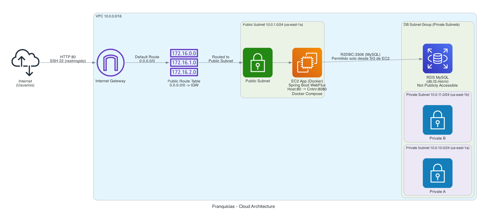
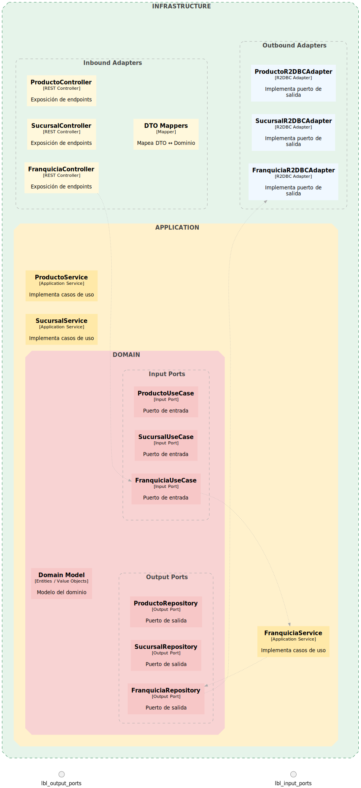

### Prueba técnica Líder técnico Full Stack en Nequi 💜
# API de Franquicias
API desplegado en: http://ec2-3-83-12-29.compute-1.amazonaws.com/swagger-ui/index.html#/


API RESTful para la gestión de franquicias, sucursales y productos, desarrollada con Spring Boot, WebFlux (programación reactiva) y arquitectura hexagonal.

## Criterios de Aceptación

- [x] El proyecto debe ser desarrollado en Spring Boot.
- [x] Exponer endpoint para agregar una nueva franquicia.
- [x] Exponer endpoint para agregar una nueva sucursal a una franquicia.
- [x] Exponer endpoint para agregar un nuevo producto a una sucursal.
- [x] Exponer endpoint para eliminar un nuevo producto a una sucursal.
- [x] Exponer endpoint para modificar el stock de un producto.
- [x] Exponer endpoint que permita mostrar cuál es el producto que más stock tiene por sucursal para una franquicia puntual. Debe retornar un listado de productos que indique a qué sucursal pertenece.
- [x] Utilizar sistemas de persistencia de datos (MySQL) en un proveedor de Nube.

**Puntos extra**

- [x] Plus: la aplicación se empaqueta con Docker.
- [x] Plus: programación funcional/reactiva (Spring WebFlux).
- [x] Plus: endpoint para actualizar el nombre de una franquicia.
- [x] Plus: endpoint para actualizar el nombre de una sucursal.
- [x] Plus: endpoint para actualizar el nombre de un producto.
- [x] Plus: la persistencia de datos se aprovisiona con Infraestructura como Código (Terraform).
- [x] Plus: toda la solución se despliega en la nube.

## Tabla de contenido

- [Arquitectura en la nube](#arquitectura-en-la-nube)
- [Arquitectura de la aplicación](#arquitectura-de-la-aplicación)
- [Comandos](#comandos)
- [Estructura del Proyecto](#estructura-del-proyecto)
- [Modelo de Datos](#modelo-de-datos)
- [Requisitos](#requisitos)
- [Ejecución](#ejecución)
- [Documentación de la API](#documentación-de-la-api)
- [Endpoints](#endpoints)
- [Ejemplos de Uso](#ejemplos-de-uso)
- [Base de datos MySQL](#base-de-datos-mysql)

## Características

- Arquitectura Hexagonal (Puertos y Adaptadores)
- Programación Reactiva con Spring WebFlux
- Programación Funcional
- Principios SOLID
- Clean Code
- Base de datos MySQL
- Documentación con OpenAPI/Swagger
- Dockerización para fácil despliegue

## Estructura del Proyecto

La aplicación sigue una arquitectura hexagonal con las siguientes capas:

- **Dominio**: Contiene las entidades del negocio y los puertos (interfaces)
- **Aplicación**: Contiene los casos de uso (servicios) que implementan la lógica de negocio
- **Infraestructura**: Contiene los adaptadores que conectan con el mundo exterior (REST, base de datos, etc.)

## Arquitectura en la nube



Despliegue en AWS con una VPC, subredes públicas y privadas, Internet Gateway, tablas de ruteo y Security Groups. La aplicación corre en una instancia EC2, con base de datos MySQL en RDS (subred privada). El acceso público a la API se expone vía la instancia EC2.

Ambiente desplegado en: http://ec2-3-83-12-29.compute-1.amazonaws.com/swagger-ui/index.html#/

## Arquitectura de la aplicación



Arquitectura hexagonal: el núcleo de dominio define puertos de entrada y salida; la capa de aplicación implementa casos de uso/servicios; los adaptadores inbound (REST controllers, mappers) y outbound (adapters R2DBC hacia MySQL) se ubican en infraestructura. El diagrama muestra el dominio centrado, con “Input Ports” y “Output Ports” agrupados, y un flujo mínimo ilustrativo.

## Comandos

- [Comandos de AWS](docs/aws_commands.md)
- [Comandos de Terraform](docs/terraform_commands.md)

## Modelo de Datos

- **Franquicia**: Entidad principal que contiene un nombre y una lista de sucursales
- **Sucursal**: Entidad que contiene un nombre y una lista de productos
- **Producto**: Entidad que contiene un nombre y una cantidad de stock

## Requisitos

- Java 21
- Gradle
- Docker (opcional, para ejecución con contenedores)

## Ejecución

### Ejecución local

Para ejecutar la aplicación localmente, sigue estos pasos:

1. Clona el repositorio
2. Navega al directorio del proyecto
3. Ejecuta el siguiente comando:

```bash
./gradlew bootRun
```

La aplicación estará disponible en `http://localhost:8080`

### Ejecución con Docker

Para ejecutar la aplicación con Docker, sigue estos pasos:

1. Clona el repositorio
2. Navega al directorio del proyecto
3. Construye y ejecuta la aplicación con Docker Compose:

```bash
docker-compose up --build
```

La aplicación estará disponible en `http://localhost:8080`

Para detener la aplicación:

```bash
docker-compose down
```

## Documentación de la API

La documentación de la API está disponible en:

- Swagger UI: `http://localhost:8080/v3/webjars/swagger-ui/index.html#/`
- OpenAPI JSON: `http://localhost:8080/api-docs`

## Endpoints

### Franquicias

| Método | Endpoint | Descripción |
|--------|----------|-------------|
| POST | `/api/franquicias` | Crear una nueva franquicia |
| GET | `/api/franquicias` | Obtener todas las franquicias |
| GET | `/api/franquicias/{id}` | Obtener una franquicia por su ID |
| PUT | `/api/franquicias/{id}` | Actualizar completamente una franquicia existente |
| PATCH | `/api/franquicias/{id}` | Actualizar parcialmente una franquicia existente (solo los campos proporcionados) |
| DELETE | `/api/franquicias/{id}` | Eliminar una franquicia |

### Sucursales

| Método | Endpoint | Descripción |
|--------|----------|-------------|
| POST | `/api/sucursales/franquicia/{franquiciaId}` | Crear una nueva sucursal para una franquicia |
| GET | `/api/sucursales/{id}` | Obtener una sucursal por su ID |
| GET | `/api/sucursales/franquicia/{franquiciaId}` | Obtener todas las sucursales de una franquicia |
| PUT | `/api/sucursales/{id}` | Actualizar completamente una sucursal existente |
| PATCH | `/api/sucursales/{id}` | Actualizar parcialmente una sucursal existente (solo los campos proporcionados) |
| DELETE | `/api/sucursales/{id}` | Eliminar una sucursal |

### Productos

| Método | Endpoint | Descripción |
|--------|----------|-------------|
| POST | `/api/productos/sucursal/{sucursalId}` | Crear un nuevo producto para una sucursal |
| GET | `/api/productos/{id}` | Obtener un producto por su ID |
| GET | `/api/productos/sucursal/{sucursalId}` | Obtener todos los productos de una sucursal |
| PATCH | `/api/productos/{id}` | Actualizar parcialmente un producto existente (solo los campos proporcionados) |
| GET | `/api/productos/max-stock/franquicia/{franquiciaId}` | Obtener el producto con más stock por sucursal para una franquicia específica |
| DELETE | `/api/productos/{id}` | Eliminar un producto |

## Ejemplos de Uso

### Actualización Parcial

Para actualizar solo el nombre de una franquicia:

```http
PATCH /api/franquicias/{id}
Content-Type: application/json

{
  "nombre": "Nuevo Nombre de Franquicia"
}
```

Para actualizar solo el stock de un producto:

```http
PATCH /api/productos/{id}
Content-Type: application/json

{
  "stock": 150
}
```

### Obtener Producto con Más Stock por Sucursal

```http
GET /api/productos/max-stock/franquicia/{franquiciaId}
```

Respuesta:
```json
[
  {
    "producto": {
      "id": 1,
      "nombre": "Producto A",
      "stock": 100
    },
    "sucursal": {
      "id": 1,
      "nombre": "Sucursal Central"
    }
  },
  {
    "producto": {
      "id": 5,
      "nombre": "Producto B",
      "stock": 75
    },
    "sucursal": {
      "id": 2,
      "nombre": "Sucursal Norte"
    }
  }
]
```

## Base de datos MySQL

La aplicación utiliza MySQL como base de datos. Cuando se ejecuta con Docker, la base de datos se configura automáticamente con los siguientes parámetros:

- Host: `mysql` (dentro de la red Docker) o `localhost` (para acceso local)
- Puerto: `3306`
- Base de datos: `franquicias`
- Usuario: `root`
- Contraseña: `root`
